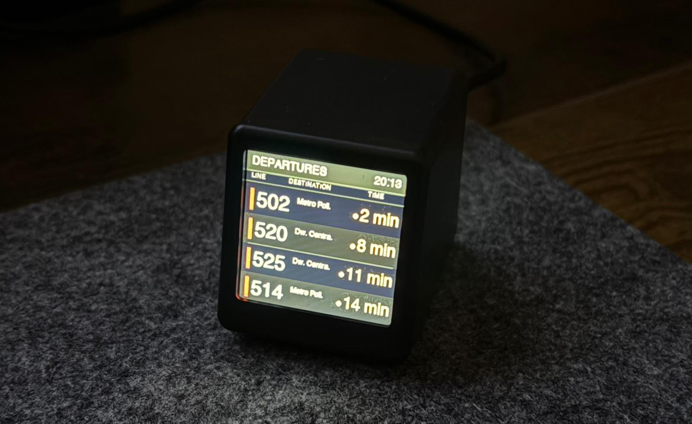
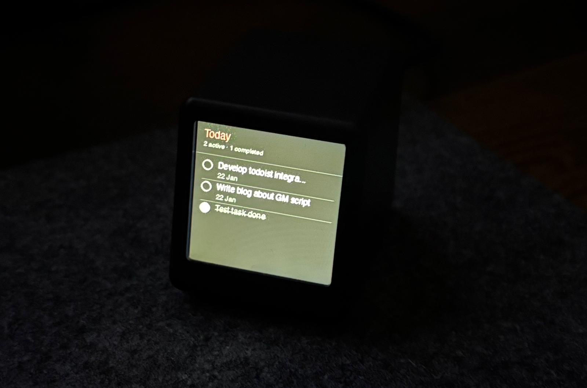

# GeekMagic Ultra Display Scripts

Turn your GeekMagic Ultra into a useful information display without any hardware mods! This project generates 240x240 images for bus departures and Todoist tasks, then uploads them to the device's built-in gallery.

 

## The Story

I got a GeekMagic Ultra after seeing [Melih Karakelle](https://x.com/MelihKarakelle)'s, but during a move, I left all my hardware tools (TTL converter, etc.) in Turkey. Instead of waiting or doing hardware mods, I found a hacky solution using just the stock firmware: continuously update the device's photo gallery from my homelab!
Started with pulling Citymapper data for the bus stop in front of my house, then added Todoist tasks. Simple Python scripts + GeekMagic's auto-gallery rotation = useful desk display.

Inspired by [fazibear's GeekMagic blog post](https://blog.fazibear.me/my-own-geekmagic-smalltv/).

## What's Included

- **cm_departures.py** - Real-time transit departures from Citymapper
- **todoist_today.py** - Today's tasks with completion tracking  
- **upload.py** - Uploads images to your device over local network

## Setup

### GeekMagic Ultra Configuration

1. Open your device's web interface (e.g., `http://192.168.100.21`)
2. Go to **Pictures** page
3. Enable these settings:
   - ✅ **Enable image auto display**
   - ⏱️ **JPG image display interval**: 30 seconds (or your preference)

### Python Environment

```bash
git clone https://github.com/calganaygun/geekmagic-ultra-scripts.git
cd geekmagic-ultra-scripts

python3 -m venv .venv
source .venv/bin/activate

pip install -r requirements.txt

cp .env.example .env
# Edit .env with your Todoist token and device IP
```

**In `.env`:**
- `TODOIST_API_TOKEN`: Get from [Todoist integrations](https://todoist.com/prefs/integrations)
- `DEVICE_URL`: Update as your GM Ultra's IP (e.g., `http://192.168.100.21/doUpload`)

## Usage

Generate and upload in one go:

```bash
python todoist_today.py && python upload.py todoist_today.jpg
python cm_departures.py && python upload.py departures.jpg
```

**How it works:** Each script generates a JPG file with the same name every time it runs. When you upload a file with the same name, it overwrites the previous one - perfect for continuous updates! The device's auto-display picks up the new image on the next cycle.

**Multiple displays:** You can also generate different images with different names (e.g., `todoist_today.jpg`, `departures.jpg`) and upload them all. The device will cycle through them based on your interval setting. For example, I see my Todoist tasks for 30 seconds, then departures for 30 seconds, then it repeats.

### Continuous Updates
Set up a cron job or systemd timer to run the scripts periodically. For example, to update every 5 minutes:

```bash
crontab -e
# Add:
*/5 * * * * cd /path/to/geekmagic-ultra-scripts && .venv/bin/python todoist_today.py && .venv/bin/python upload.py todoist_today.jpg
*/5 * * * * cd /path/to/geekmagic-ultra-scripts && .venv/bin/python cm_departures.py && .venv/bin/python upload.py departures.jpg
```

Or create your own automation script to keep the display fresh!

## Customization

Both scripts are straightforward Python - edit the constants at the top:

**todoist_today.py:**
- `MAX_TASKS`: How many tasks to show
- `BG_COLOR`, `PRIORITY_COLORS`: Styling

**cm_departures.py:**
- `STOP_ID`, `REGION_ID`: Your transit stop
- `MAX_BUSES`: Number of departures

Colors, fonts, layouts - all easy to tweak. Make it yours!

## Notes

- Tested on GeekMagic Ultra firmware Ultra-V9.0.41 (probably works on earlier versions)
- Images and `.env` are git-ignored - keep your tokens safe
- 240x240 JPEG format for the display
- Sometimes the upload may show an error like `Upload failed: Content-Length contained multiple unmatching values` - this doesn't affect functionality, everything works anyway

## License

completely free and open source, do whatever you want with it!

---

Thanks to [Melih Karakelle](https://x.com/MelihKarakelle) and [fazibear](https://blog.fazibear.me/my-own-geekmagic-smalltv/) for the inspiration to hack it.

